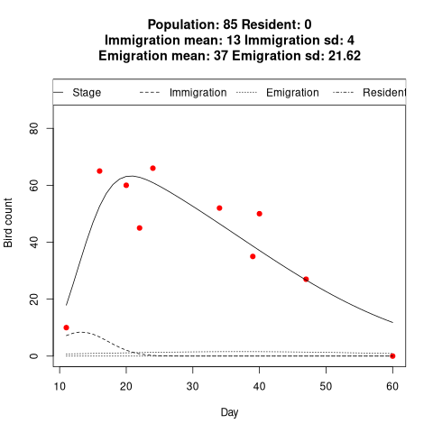

# stager


Using model from Thompson's paper.

1. Thompson, J.J. (1993). Modeling the Local Abundance of Shorebirds
Staging on Migration. Theoretical Population Biology 44, 299–315.

## Installation

```{r}
install.packages("devtools")

devtools::install_github("wolfsonliu/stager")
```

## Usage

First, read bird count data, day and counts are required.
```{r}
birdcount <- data.frame(
    day=c(11, 16, 20, 22, 24, 34, 39, 40, 47, 60),
    daycount=c(10, 65, 60, 45, 66, 52, 35, 50, 27, 0)
)
```

Then, estimate stage variables. For those variables to be estimated,
the possible value ranges should be provided. And for the variables do
not need estimation, provide the exact values.

```{r}
result <- calculate.stage.variables(
    day=birdcount$day,
    daycount=birdcount$daycount,
    population=85,
    resident=0,
    immigrate.mean=c(10, 20),
    emigrate.mean=c(20, 50),
    immigrate.sd=c(4, 10),
    emigrate.sd=c(10, 30)
)
```

Finaly, plot the result.

```{r}
plot(result)
```


